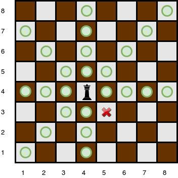
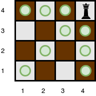

# Queen-s-Attack-II-HackerRank
## Queen's Attack II JS Solution

> It's a pretty bad solution for Queen's Attack II Problem by [bishop15](https://www.hackerrank.com/profile/bishop15).

Click [here](https://www.hackerrank.com/challenges/queens-attack-2/problem) to get problem page. 

## Problem

You will be given a square chess board with one queen and a number of obstacles placed on it. Determine how many squares the queen can attack.

A [queen](https://en.wikipedia.org/wiki/Queen_%28chess%29) is standing on an **n x n**  [chessboard](https://en.wikipedia.org/wiki/Chess). The chess board's rows are numbered from **1 to n**, going from bottom to top. Its columns are numbered from  **1 to n**, going from left to right. Each square is referenced by a tuple, **(r, c)**, describing the row, **r** , and column, **c** , where the square is located.

The queen is standing at position **(rq, cq)** . In a single move, she can attack any square in any of the eight directions (left, right, up, down, and the four diagonals). In the diagram below, the green circles denote all the cells the queen can attack from **(4, 4)**:


There are obstacles on the chessboard, each preventing the queen from attacking any square beyond it on that path. For example, an obstacle at location **(3, 5)** in the diagram above prevents the queen from attacking cells **(3, 5)**, **(2, 6)**, and **(1, 7)**:



Given the queen's position and the locations of all the obstacles, find and print the number of squares the queen can attack from her position at **(rq, rc)** . In the board above, there are **24** such squares.

## Function Description

Complete the queensAttack function in the editor below. It should return an integer that describes the number of squares the queen can attack.

queensAttack has the following parameters:
- n: an integer, the number of rows and columns in the board
- k: an integer, the number of obstacles on the board
- r_q: integer, the row number of the queen's position
- c_q: integer, the column number of the queen's position
- obstacles: a two dimensional array of integers where each element is an array of **2** integers, the row and column of an obstacle

## Input Format

The first line contains two space-separated integers **n** and **k**, the length of the board's sides and the number of obstacles.
The next line contains two space-separated integers **rq** and **cq**, the queen's row and column position.
Each of the next **k** lines contains two space-separated integers **r[i]** and **c[i]**, the row and column position of **obstacle[i]**.

## Constraints

- **0 < n <= 10^5**
- **0 <= k <= 10^5**
- A single cell may contain more than one obstacle.
- There will never be an obstacle at the position where the queen is located.

## Subtasks

For **30%** of the maximum score:
- **0 < n <= 100**
- **0 <= k <= 100**

For **55%** of the maximum score:
- **0 < n <= 1000**
- **0 <= k <= 10^5**

## Output Format

Print the number of squares that the queen can attack from position **(rq, cq)**.

## Sample Input 0

```
4 0
4 4
```
## Sample Output 0

```
9
```

## Explanation 0

The queen is standing at position **(4, 4)** on a **4 x 4** chessboard with no obstacles:



## Sample Input 1

```
5 3
4 3
5 5
4 2
2 3
```
## Sample Output 1

```
10
```

## Explanation 1

The queen is standing at position **(4, 3)** on a **5 x 5** chessboard with **k = 3** obstacles:


The number of squares she can attack from that position is **10**.

## Sample Input 2

```
1 0
1 1
```

## Sample Output 2

```
0
```

## Explanation 2

Since there is only one square, and the queen is on it, the queen can move 0 squares.

# Code Explanation

## Variables Explanation

- x | X axis of Queen's location.
- y | Y axis of Queen's location.
- del | Total deleted cells number which is blocked by obstacles.
- mid | Middle value of n x n matrix.
- rank | Rank describes the obstacles' distance to mid.
- xEyB contains the obstacle's y-axis. Obstacle's y-axis is greater than Queen's one when both x-axis are same.
- xEyK contains the obstacle's y-axis. Obstacle's y-axis is less than Queen's one when both x-axis are same.
- xKyE contains the obstacle's x-axis. Obstacle's x-axis is less than Queen's one when both y-axis are same.
- xByE contains the obstacle's x-axis. Obstacle's x-axis is greater than Queen's one when both y-axis are same.
- xKyKx contains the bottom-left obstacle's x-axis.
- xKyKy contains the bottom-left obstacle's y-axis.
- xKyBx contains the top-left obstacle's x-axis.
- xKyBy contains the top-left obstacle's y-axis.
- xByKx contains the bottom-right obstacle's x-axis.
- xByKy contains the bottom-right obstacle's y-axis.
- xByBx contains the top-right obstacle's x-axis.
- xByBy contains the top-right obstacle's y-axis.

## Algorithm Explanation

> This code finds the maximum available cells using matrix dimension and Queen's location. Doesn't count any of obstacles.
```javascript
  if (n % 2 === 0) {
    mid = (n + 1) / 2;
    rank = Math.max(
      Math.floor(Math.abs(x - mid)),
      Math.floor(Math.abs(y - mid))
    );
    total = (n / 2 - 1) * 4 + 1 - rank * 2 + (n - 1) * 2;
  } else {
    mid = (n + 1) / 2;
    rank = Math.max(Math.abs(x - mid), Math.abs(y - mid));
    total = (n - 1) * 2 - rank * 2 + (n - 1) * 2;
  }
```

> This code filters the obstacles array to find the closest obstacles to Queen.
```javascript
  obstacles.forEach(obs => {
    // obs[1]=x, obs[0]=y;
    if (obs[1] === x && obs[0] > y) xEyB = obs[0] < xEyB ? obs[0] : xEyB;
    else if (obs[1] === x && obs[0] < y) xEyK = obs[0] > xEyK ? obs[0] : xEyK;
    else if (obs[0] === y && obs[1] < x) xKyE = obs[1] > xKyE ? obs[1] : xKyE;
    else if (obs[0] === y && obs[1] > x) xByE = obs[1] < xByE ? obs[1] : xByE;
    else if (Math.abs(obs[0] - y) === Math.abs(obs[1] - x)) {
      if (obs[1] < x && obs[0] < y) {
        if (obs[1] > xKyKx && obs[0] > xKyKy) {
          xKyKx = obs[1];
          xKyKy = obs[0];
        }
      } else if (obs[1] < x && obs[0] > y) {
        if (obs[1] > xKyBx && obs[0] < xKyBy) {
          xKyBx = obs[1];
          xKyBy = obs[0];
        }
      } else if (obs[1] > x && obs[0] < y) {
        if (obs[1] < xByKx && obs[0] > xByKy) {
          xByKx = obs[1];
          xByKy = obs[0];
        }
      } else if (obs[1] > x && obs[0] > y) {
        if (obs[1] < xByBx && obs[0] < xByBy) {
          xByBx = obs[1];
          xByBy = obs[0];
        }
      }
    }
  });
```

> This code calculates total number of deleted cells.
```javascript
  obstacles.forEach(obs => {
    // obs[1]=x, obs[0]=y;
    if (obs[1] === x && obs[0] > y) xEyB = obs[0] < xEyB ? obs[0] : xEyB;
    else if (obs[1] === x && obs[0] < y) xEyK = obs[0] > xEyK ? obs[0] : xEyK;
    else if (obs[0] === y && obs[1] < x) xKyE = obs[1] > xKyE ? obs[1] : xKyE;
    else if (obs[0] === y && obs[1] > x) xByE = obs[1] < xByE ? obs[1] : xByE;
    else if (Math.abs(obs[0] - y) === Math.abs(obs[1] - x)) {
      if (obs[1] < x && obs[0] < y) {
        if (obs[1] > xKyKx && obs[0] > xKyKy) {
          xKyKx = obs[1];
          xKyKy = obs[0];
        }
      } else if (obs[1] < x && obs[0] > y) {
        if (obs[1] > xKyBx && obs[0] < xKyBy) {
          xKyBx = obs[1];
          xKyBy = obs[0];
        }
      } else if (obs[1] > x && obs[0] < y) {
        if (obs[1] < xByKx && obs[0] > xByKy) {
          xByKx = obs[1];
          xByKy = obs[0];
        }
      } else if (obs[1] > x && obs[0] > y) {
        if (obs[1] < xByBx && obs[0] < xByBy) {
          xByBx = obs[1];
          xByBy = obs[0];
        }
      }
    }
  });
```

